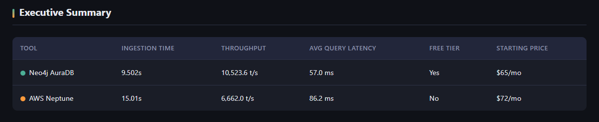
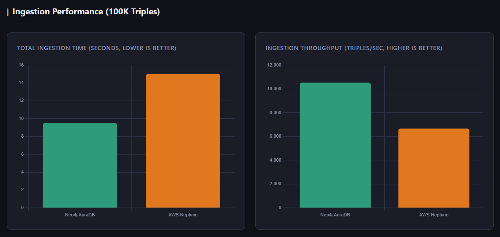
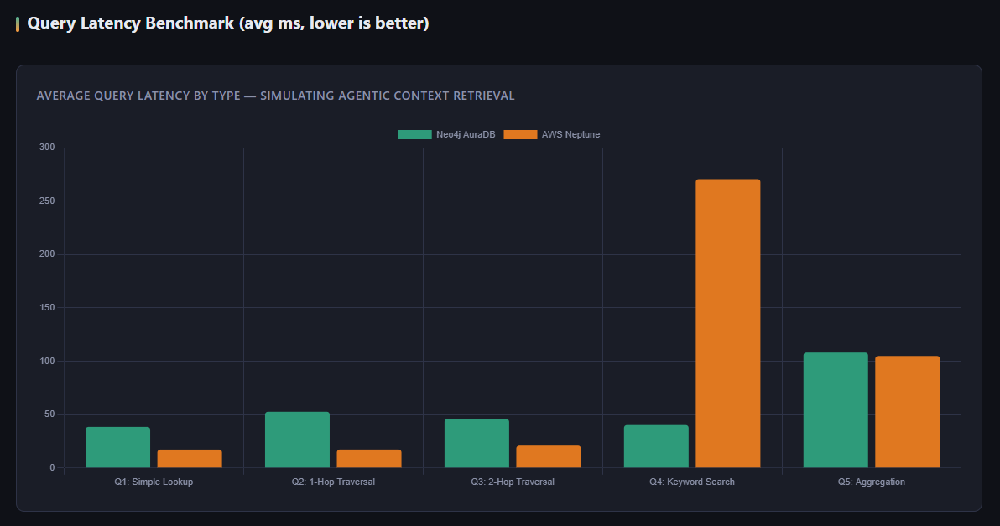
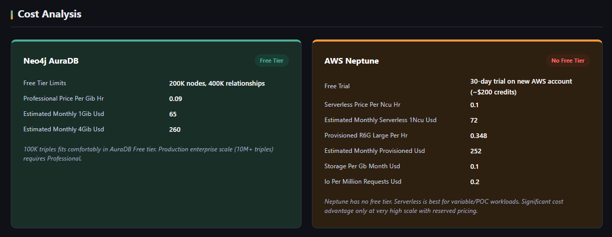

# kg-benchmark-poc

**Knowledge Graph Cost & Performance Benchmark — Neo4j AuraDB vs AWS Neptune**

A live POC benchmarking two enterprise knowledge graph platforms as context layers for agentic AI systems. Built as part of Xebia's enterprise agentic AI research program.

---

## Key Findings

Benchmarked on a 100K triple synthetic enterprise dataset (companies, employees, products, locations) simulating a real-world agentic context retrieval workload.

| Metric | Neo4j AuraDB | AWS Neptune |
|---|---|---|
| Ingestion Time | **9.5s** | 15.0s |
| Throughput | **10,524 t/s** | 6,662 t/s |
| Avg Query Latency | **57ms** | 86ms |
| Q1 Simple Lookup | 38ms | **17ms** |
| Q2 1-Hop Traversal | 53ms | **17ms** |
| Q3 2-Hop Traversal | 46ms | **21ms** |
| Q4 Keyword Search | **40ms** | 271ms |
| Q5 Aggregation | **108ms** | 105ms |
| Free Tier | **Yes** | No |
| Starting Price | **$65/mo** | $72/mo |

**Neo4j wins:** ingestion speed, keyword search (6x faster), free tier availability.
**Neptune wins:** graph traversal queries Q1-Q3 (2x faster), better for RDF/SPARQL workloads.

---

## Screenshots

### Executive Summary


### Ingestion Performance


### Query Latency Benchmark


### Cost Analysis


---

## Repo Structure

```
kg-benchmark-poc/
├── run_all.py                  # Master orchestrator — run this
├── generate_report.py          # HTML report generator
├── requirements.txt
├── .env                        # Your credentials (never commit this)
├── .gitignore
├── benchmarks/
│   ├── benchmark_neo4j.py      # Neo4j AuraDB benchmark
│   └── benchmark_neptune.py    # AWS Neptune benchmark
├── results/                    # Auto-created — JSON outputs + HTML report
└── screenshots/                # Report screenshots for README
```

---

## Quickstart

```bash
# 1. Install dependencies
pip install -r requirements.txt

# 2. Set credentials in .env
NEO4J_URI=neo4j+s://<your-instance>.databases.neo4j.io
NEO4J_USER=neo4j
NEO4J_PASSWORD=<your-password>

NEPTUNE_ENDPOINT=https://<your-cluster>.cluster.us-east-1.neptune.amazonaws.com:8182
NEPTUNE_REGION=us-east-1

# 3. Run Neo4j locally
python run_all.py --skip-neptune

# 4. Run Neptune from a Neptune Notebook (must be inside AWS VPC)
#    Upload benchmarks/benchmark_neptune.py to the notebook and run:
#    python benchmark_neptune.py
#    Download results/neptune_results.json and place it in results/

# 5. Generate the report
python generate_report.py

# 6. Open the report
open results/knowledge_graph_benchmark_report.html
```

---

## Benchmark Methodology

All queries simulate what an enterprise AI agent would actually do when retrieving context from a knowledge graph:

| Query | What it simulates |
|---|---|
| Q1 Simple Lookup | Agent fetching a single entity's data |
| Q2 1-Hop Traversal | Agent finding direct relationships of an entity |
| Q3 2-Hop Traversal | Agent exploring subgraph context |
| Q4 Keyword Search | Agent searching by partial entity name |
| Q5 Aggregation | Agent summarizing relationship patterns across the graph |

Dataset: 100K synthetic enterprise triples (Wikidata-style) — companies, employees, products, locations, and their relationships. Same dataset used on both platforms for a fair comparison.

---

## Neptune Setup Note

Neptune requires you to be inside your AWS VPC to connect. For this POC, run `benchmark_neptune.py` from a **Neptune Notebook** (AWS Console → Neptune → Notebooks). Neo4j runs fine locally.

IAM authentication must be **disabled** on the Neptune cluster for this script to work without additional AWS credential configuration.

---

## Cost Summary

| | Neo4j AuraDB | AWS Neptune |
|---|---|---|
| Free tier | 200K nodes, 400K rels | None |
| POC cost | $0 | ~$0 (AWS free trial) |
| Production (small) | $65/mo (1 GiB) | $72/mo (1 NCU serverless) |
| Production (medium) | $260/mo (4 GiB) | $252/mo (provisioned r6g.large) |

---

## Tech Stack

- **Neo4j AuraDB** — Cypher, property graph model, Python `neo4j` driver
- **AWS Neptune Serverless** — SPARQL 1.1, RDF triple model, `SPARQLWrapper` + `requests`
- **Report** — Self-contained HTML with Chart.js, no external dependencies beyond CDN

---

*Xebia Agentic AI Research · June 2026*
